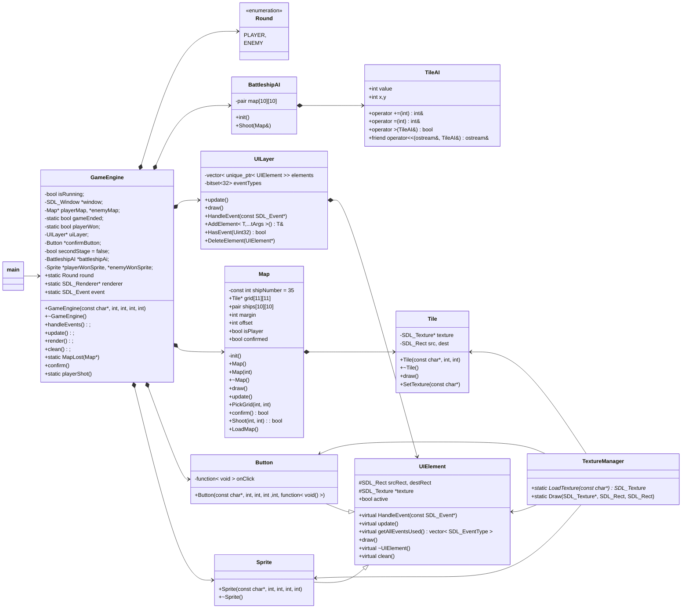

---
Battleship ULM
---

```mermaid
classDiagram
direction LR

main --> GameEngine
GameEngine *--> Round
GameEngine *--> BattleshipAI
GameEngine *--> UILayer

GameEngine *--> Map
GameEngine *--> Button
GameEngine *--> Sprite

Button <-- TextureManager
Sprite <-- TextureManager
Tile <-- TextureManager
UIElement <-- TextureManager

BattleshipAI *--> TileAI
Map *--> Tile

Button --|> UIElement
Sprite --|> UIElement

UILayer *--> UIElement

class GameEngine{

    -bool isRunning;
    -SDL_Window *window;
    -Map* playerMap, *enemyMap;
    -static bool gameEnded;
    -static bool playerWon;
    -UILayer* uiLayer;
    -Button *confirmButton;
    -bool secondStage = false;
    -BattleshipAI *battleshipAi;
    -Sprite *playerWonSprite, *enemyWonSprite;

    +static Round round
    +GameEngine(const char*, int, int, int, int)
    +~GameEngine()  
    +handleEvents();
    +update();
    +render();
    +clean();

    +static SDL_Renderer* renderer
    +static SDL_Event event
    +static MapLost(Map*)
    +confirm()
    +static playerShot()
}

class Round{
<<enumeration>>
PLAYER,
ENEMY
}

class Tile{
-SDL_Texture* texture
-SDL_Rect src, dest

    +Tile(const char*, int, int)
    +~Tile()
    +draw()
    +SetTexture(const char*)
}

class Map{
-const int shipNumber = 35
-init()

    +Tile* grid[11][11]
    +pair<bool,bool> ships[10][10]

    +int margin
    +int offset
    +bool isPlayer
    +bool confirmed
    +Map()
    +Map(int)
    +~Map()
    +draw()
    +update()
    +PickGrid(int, int)
    +confirm() bool
    +Shoot(int, int): bool
    +LoadMap()
}

class TextureManager{
+static LoadTexture(const char*) SDL_Texture*
+static Draw(SDL_Texture*, SDL_Rect, SDL_Rect)
}

class TileAI{
+int value
+int x,y
+operator +=(int) int&
+operator =(int) int&
+operator >(TileAI&) bool
+friend operator<<(ostream&, TileAI&) ostream&
}

class BattleshipAI{
-pair<bool, bool> map[10][10]

    +init()
    +Shoot(Map&)
}

class UIElement{
#SDL_Rect srcRect, destRect
#SDL_Texture *texture
+bool active
+virtual HandleEvent(const SDL_Event*)
+virtual update()
+virtual getAllEventsUsed() vector< SDL_EventType >
+draw()
+virtual ~UIElement()
+virtual clean()
}

class UILayer{
-vector< unique_ptr< UIElement >> elements
-bitset<32> eventTypes

    +update()
    +draw()
    +HandleEvent(const SDL_Event*)    
    +AddElement< T,...tArgs >() T&
    +HasEvent(Uint32) bool
    +DeleteElement(UIElement*)
}

class Sprite{
+Sprite(const char*, int, int, int, int)
+~Sprite()
}

class Button{
-function< void > onClick
+Button(const char*, int, int, int ,int, function< void() >)
}
```